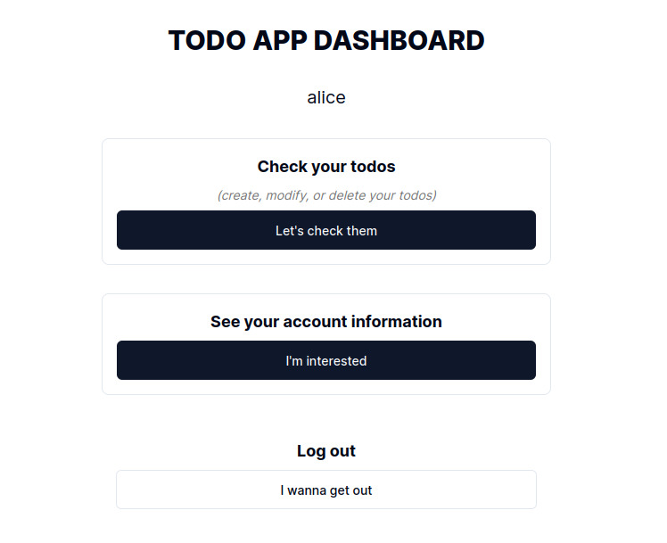
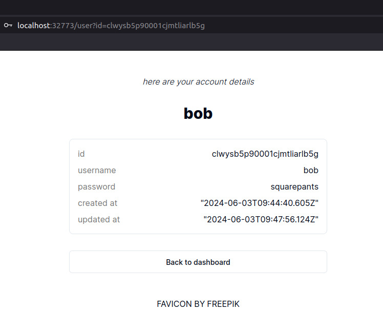
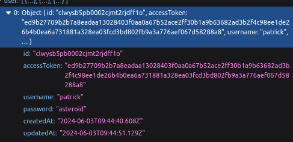
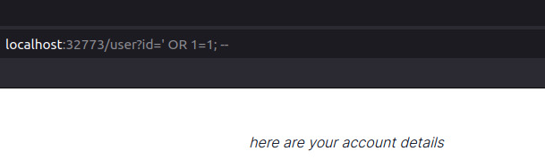
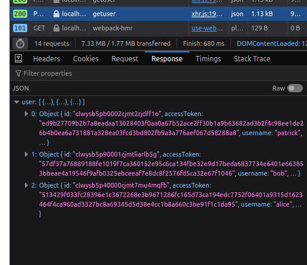
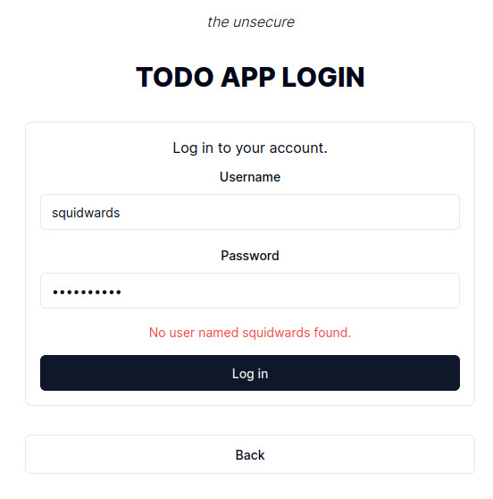
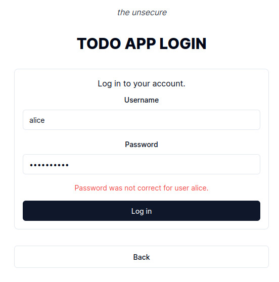
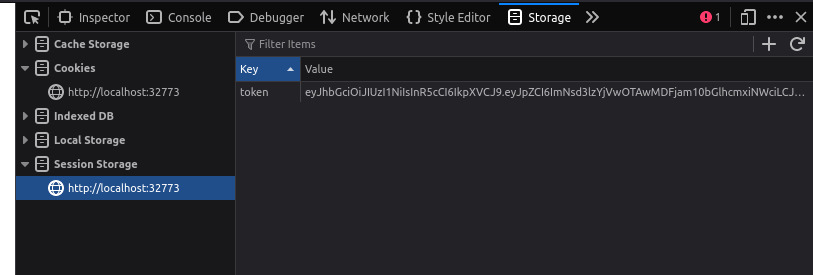

# SECURITY ISSUES

This document describes all the security issues present in the application. The issues are based on the [OWASP Top 10 list for 2021](https://owasp.org/www-project-top-ten/ "OWASP Top Ten"). There are five issues present in the application.

## Issue 1 - [A01 Broken Access Control](https://owasp.org/Top10/A01_2021-Broken_Access_Control/ "OWASP/Top 10: Broken Access Control")

**OWASP**: "_Bypassing access control checks by modifying the URL (parameter tampering or force browsing), internal application state, or the HTML page, or by using an attack tool modifying API requests._"

### How this is present in my application

User data fetching on route `/user` is not safe. While the user information fetching requires access token, the API request is made based on the URL parameter. You can give any user ID within the URL `?id=` search parameter to query for any user in the database.

### How to perform an attack against the unsecure system yourself

User IDs are automatically generated UUIDs, so try not to guess a user ID. Instead, copy a user ID for yourself from the user information page (when logged in as that user). Then, log out, and log in as **any other** user. Navigate again to `/user`, and replace the search parameter for `id` with the previous user's ID, e.g. the one you copied first. See the results.

### Example

1. Alice is logged in to the application.

1. Alice navigates to her user information page, but replaces the URL parameter to Bob's ID. Now she can see Bob's information.

## Issue 2 - [A02 Cryptographic Failures](https://owasp.org/Top10/A02_2021-Cryptographic_Failures/ "OWASP/Top 10: Cryptographic Failures")

**OWASP**: "_Shifting up one position to #2, previously known as Sensitive Data Exposure, which is more of a broad symptom rather than a root cause, the focus is on failures related to cryptography (or lack thereof). Which often lead to exposure of sensitive data._"

### How this is present in my application

As a default, passwords are not encrypted in the database. They are stored as plaintext. If anyone hypothetically got access to the database, they could read the passwords in clear text.

### How to perform an attack against the unsecure system yourself

While inspecting the [next issue](./security_issues.md#issue-3---a03-injection "Issue 3 - A03 Injection"), you can clearly see that the passwords are stored in plaintext. If you manage to retrieve other user's information, you can see their passwords as well!

### Example

1. During the SQL injection, which you can read about in the [next issue](./security_issues.md#issue-3---a03-injection "Issue 3 - A03 Injection"), you can simply read the passwords in plaintext!

## Issue 3 - [A03 Injection](https://owasp.org/Top10/A03_2021-Injection/ "OWASP/Top 10: Injection")

**OWASP**: "_An application is vulnerable to attack when:_

_- User-supplied data is not validated, filtered, or sanitized by the application._

_- Dynamic queries or non-parameterized calls without context-aware escaping are used directly in the interpreter._

_- Hostile data is used within object-relational mapping (ORM) search parameters to extract additional, sensitive records._

_- Hostile data is directly used or concatenated. The SQL or command contains the structure and malicious data in dynamic queries, commands, or stored procedures._"

### How this is present in my application

The user data is fetched in a dangerous manner when user info is retrieved. The user ID for database query is fetched from the URL search parameter (see [first issue](./security_issues.md#how-this-is-present-in-my-application "Issue 1 - How this is present in my application")), and directly used in the SQL command. While the library I've used in my application does not allow _prepared statements with multiple commands_, the data is still left exposed and vulnerable for an SQL injection.

### How to perform an attack against the unsecure system yourself

While logged in, replace the user ID within the URL `?id=` search parameter to `' OR 1=1; --`. This will return the complete user table from the database. You may read the list by navigating to your browser's developer tools (open with F12) and looking at the response from the API request ("Network" tab).

**How to view network traffic?** Open developer tools with F12. Open "Network" tab and browse through the traffic history. **Note**: Browsers usually require you to refresh the page to see the network traffic.

### Example

1. Let's perform an SQL injection attack. When logged in, let's navigate to the user information page and replace the user ID with `' OR 1=1; --`.

2. After page load is finished, let's inspect the response from the API request. We can see that the response contains all the users in the database.

## Issue 4 - [A04 Insecure Design](https://owasp.org/Top10/A04_2021-Insecure_Design/ "OWASP/Top 10: Insecure Design")

**OWASP**: "_Notable Common Weakness Enumerations (CWEs) include CWE-209: Generation of Error Message Containing Sensitive Information, ..., and CWE-522: Insufficiently Protected Credentials._"

### How this is present in my application

Response messages from the server during login are not generic. They give away information about the user's existence (or the lack thereof) in the database.

Other insecure design issues are present in the API design as well, like the returning of passwords and access tokens, which should not be returned to user when inspecting their account details (page `/user`).

### How to perform an attack against the unsecure system yourself

Try to login with wrong credentials. The response message will tell you if the user exists in the database or not. And if the user exists, it will tell you that the password is wrong.

Also check the full response object from the API when loading the `/user` page. It will return the user's access token.

### Example

1. While logged out, we can retrieve information about the existence of any given user in the database. Let's try to login with a user that does not exist.

2. We can also check if password is correct for a user that does exist.

3. On top of that, you most likely noticed already during the [SQL injection segment](./security_issues.md#issue-3---a03-injection "Issue 3 - A03 Injection"), that the `/getuser` API route returns the user's access token, which is not necessary by any means.

## Issue 5 - [A07 Identification and Authentication Failures](https://owasp.org/Top10/A07_2021-Identification_and_Authentication_Failures/ "OWASP/Top 10: Identification and Authentication Failures")

**OWASP**: "_Does not correctly invalidate Session IDs. User sessions or authentication tokens (mainly single sign-on (SSO) tokens) aren't properly invalidated during logout or a period of inactivity._"

### How this is present in my application

The session token is not invalidated when the user logs out. The token is still valid and can be used to access the system. The token is, however, invalidated/updated when the user logs in again. This still leaves a window of opportunity for an attacker to use the token to access the system.

**On top of that**, the token is stored in the session storage of the browser. This means that the token is not stored in a secure manner; token-based authentication should be stored in a secure _HttpOnly_-cookie in a real-life application. However, to keep the application simple, the token is stored in the session storage. Proper _HttpOnly_-cookie storage would prevent the token from being accessed by client JavaScript altogether.

### How to perform an attack against the unsecure system yourself

Log in as any user. Copy the value for the `token` key from your browser's session storage. Now log out by clicking "I wanna get out" button on dashboard. Open a new tab in your browser and visit the `/user` page (still logged out). Open developer tools and create a new entry into the session storage for `token` with the copied value. Refresh the page. You are now logged in as the user you copied the token from.

**How to access session storage?** First, open developer tools with F12.

- If using _Chrome_ or _MS Edge_, open tab "Application" and below subheader "Storage", click "Session storage".
- If using _Firefox_, open tab "Storage" and click "Session Storage".

The route is largely similar with other web browsers as well.

### Example

1. By copying the token, and modifying the session storage manually, we can reload the `/user` page after logging out, and we are still logged in.

